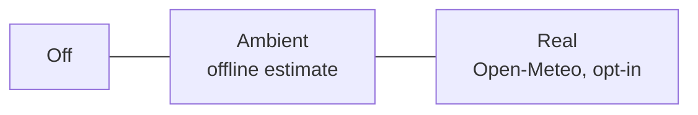

---
tags:
  - architecture
  - settings
  - features
created: 2026-06-03
status: Implemented
---

# Settings, Feature Toggles & Search Behavior

This document describes the user-configurable feature system of **Slim Launcher**: the Settings screen, the preference storage layer, the smart search panel, and the adaptive theming engine.

Back to **[[index|Main Hub]]** | Previous: **[[ui_ux_layout|UI/UX Layout & Gesture Mechanics]]**

---

## ⚙️ Settings Entry Point

Slim deliberately has **no persistent settings button** on the home screen. Instead, the launcher's own entry ("Slim") in the app list acts as the settings shortcut:

- Tapping **Slim** in the alphabetical list or search results opens `SettingsActivity`.
- Long-pressing the Slim entry does the same.
- A Settings shortcut row also sits at the very end of the all-apps list (reached by scrubbing the alphabet). It carries Slim's own launcher icon so it matches every icon-bearing row above it (hidden in text-only mode, like all rows).

The header weather chip is purely informational — it intentionally does **nothing** on tap (it used to open Settings, but that sat right under the clock and was an easy mis-tap). This keeps the home screen at zero visual overhead while keeping settings one obvious tap away.

## 🗄️ Preference Storage (`SlimPreferences.kt`)

All options are stored in `SharedPreferences` (`slim_launcher_prefs`) behind a typed wrapper:

| Key | Type | Default | Purpose |
|---|---|---|---|
| `show_clock` | Boolean | `true` | Show/hide the header clock |
| `show_date` | Boolean | `true` | Show/hide the header date |
| `use_24_hour` | Boolean | `true` | 24-hour vs 12-hour clock |
| `world_clock_tz` | String | `""` | IANA timezone id for the optional secondary clock; empty = off |
| `world_clock_label` | String | `""` | Display label (city name) for the world clock |
| `weather_mode` | String | `simulated` | `off` / `simulated` (ambient, offline) / `real` (Open-Meteo) |
| `weather_city` / `weather_lat` / `weather_lon` | String/Float | — | Geocoded city for real weather |
| `weather_fahrenheit` | Boolean | `false` | °C vs °F |
| `weather_cache` / `weather_cache_time` | String/Long | — | Last fetched weather (30-minute TTL) |
| `search_history_enabled` | Boolean | `true` | Remember recently searched apps |
| `search_history` | String | — | Pipe-separated package names, most recent first (max 8) |
| `show_app_icons` | Boolean | `true` | Show icons vs. text-only minimal list |
| `background_mode` | String | `solid_black` | `transparent` / `dimmed` / `solid_black` window background |
| `immersive_mode` | Boolean | `false` | Hide status bar; show notification count + battery in header |
| `focus_screen` | Boolean | `false` | Focus screen — long-press the clock to blank home down to a clock |
| `default_launcher_prompt_shown` | Boolean | `false` | Set once the default-Home role chooser has been shown; persisted so it is never auto-shown a second time |
| `swipe_up_search` | Boolean | `true` | Enable/disable the swipe-up search gesture |
| `swipe_down_notifications` | Boolean | `true` | Swipe down to open the system notification shade |
| `comm_notifications_only` | Boolean | `true` | Surface only communication notifications on home |
| `widget_ids` | String | `""` | Comma-joined ordered app-widget ids on the home strip (empty = none; legacy `widget_id` Int migrated in) |

## 🌦️ Weather Modes



1. **Off** — header shows clock/date only.
2. **Ambient** (default) — an offline, seasonal estimate. Clearly labeled in Settings as an estimate; makes zero network calls.
3. **Real** — the user types a city; `WeatherService` geocodes it via the Open-Meteo geocoding API and fetches current conditions (WMO code → emoji + description) at most every 30 minutes. Requires the `INTERNET` permission, which is used for nothing else.

### Upcoming-change hint
The same forecast request also asks for `hourly=weather_code,precipitation_probability` (Open-Meteo returns it in one call, so this costs a few extra KB, not an extra request) and `timezone=auto` so hourly buckets and labels land in the location's own local time rather than GMT. `WeatherService.findUpcomingChange()` scans the next 9 hourly entries for the first hour where precipitation becomes likely (category changes from dry to wet, or probability ≥ 50%) and appends a short suffix like `· rain by 4pm` to the chip — silent otherwise, so the chip stays exactly as terse as before by default.

The current-conditions call also requests `precipitation` (mm) alongside the categorical `weather_code`. If the API reports live precipitation but the code hasn't caught up to a rain/snow/storm category, the code is treated as light rain for display purposes — the model's WMO code is a forecast label and can lag a live measurement. Note this still can't surface very localized, short-lived convective showers the underlying model's grid never resolved in the first place; that's an inherent limitation of forecast-model data, not something client-side logic can work around.

## 🕒 World Clock

An optional single secondary clock (Settings → Home → World clock), rendered inline at the bottom-right of the primary clock, baseline-aligned, smaller and at reduced alpha so it reads as a companion rather than a second competing line. Backed by `world_clock_tz`/`world_clock_label`; ticks off the same handler-based clock loop as the primary time (see below), reformatted with a `SimpleDateFormat` pinned to the configured `TimeZone`.

Android has no shared, cross-OEM API for the world clocks a user has configured in the stock Clock app — that list lives in the Clock app's own private database. So this is Slim's own setting, picked from a curated list of ~30 major cities (`WorldClockOptions.kt`) rather than the full ~450-entry IANA zone database, in keeping with the picker staying as minimal as everything else.

## 🔍 Search Panel Behavior

The floating search panel (swipe up to open) consists of three stacked elements, all rendered **above** the dim scrim so results are unmistakably tappable:

```
+--------------------------------------+
|  [🔍  Search apps…              ]    |   <- input box
|  ( Chrome ) ( Maps ) ( Spotify )     |   <- recent-search quick chips
|  ───────────────────────────────     |
|  ▸ Calendar                          |   <- live ranked results
|  ▸ Calculator                        |
+--------------------------------------+
            dimmed wallpaper             <- scrim (below panel)
```

### Result ranking
Matching is case-insensitive against **any part** of the app label, ranked:

1. Label **starts with** the query (`cal` → *Calendar*)
2. Any **word** in the label starts with the query (`dri` → *Google Drive*)
3. Label **contains** the query anywhere (`mer` → *Camera*)

Ties within a rank are sorted alphabetically.

### Recent searches
When an app is launched *from search* (results or chips), its package is pushed onto the history (max 8, deduplicated). The chips row shows these apps whenever the search panel opens with an empty query — instant re-launch without making them favorites. The feature can be disabled or cleared in Settings.

### Pause / resume lifecycle
The search panel's visibility survives across `onPause` → `onResume` transitions:

- **Screen off / power button while typing** (`imeWasOpenBeforePause == true`): the panel stays visible; `onResume` re-requests focus and shows the keyboard via `post{}` (deferred one frame to avoid racing with the window manager's focus-token assignment).
- **Home press with panel open** (`imeWasOpenBeforePause == false`): `onResume` dismisses the panel silently so the user returns to a clean home state.

This avoids the previous bug where the search bar appeared on resume with no keyboard and no way to type.

## 🎨 Adaptive Theming

The launcher draws directly on the system wallpaper, so readability is handled at runtime:

1. `WallpaperManager.getWallpaperColors()` is queried on every resume.
2. On Android 12+, the `HINT_SUPPORTS_DARK_TEXT` color hint decides between the light-text and dark-text palettes; older versions fall back to a luminance check of the wallpaper's primary color.
3. The accent color uses **Material You** (`system_accent1_200`) on Android 12+, indigo otherwise.
4. Header text carries a subtle shadow so it stays legible even on busy wallpapers.
5. The alphabet index (`WaveGestureView`) and home app list receive the same adaptive palette; the search panel keeps fixed light-on-dark colors since it has its own dark surface.
6. The Favorites section fades progressively toward the bottom of that section (`AppListAdapter.FAVORITE_FADE_STEP`/`FAVORITE_FADE_FLOOR`), a purely decorative touch applied per-row in `onBindViewHolder`. `appRecyclerView.itemAnimator` is disabled — RecyclerView's default item animator runs its own alpha fade on every item-change update and resets alpha to 1 when it finishes, which was silently clobbering this effect on any list rebuild (notification events, icon/color toggles, app refresh).
7. In-app dialogs (long-press menu, rename, hidden apps) use `Theme.Slim.Dialog`, matching the app's own dark surface palette (`surface_elevated`/`border_color`) instead of the stock light Material dialog chrome.

## 🌑 Focus Screen

*Settings → Appearance → Focus screen* (opt-in, **off by default** — so the
long-press does nothing until you turn it on).

When enabled, **long-pressing the home-screen clock** drops a full-screen black
veil (`R.id.focusVeil` in `activity_main.xml`) over everything, showing only a
large clock, the date (if `show_date` is on), and a notification count (if any).
A tap or an upward swipe brings the home screen back; Back dismisses it before
any other home state; a Home press dismisses it via `onNewIntent`.

### Why it's a gesture and not a lock/wake screen

Slim is an ordinary third-party launcher. It **cannot**:

- replace or theme Android's secure Keyguard, or draw anything over it;
- reliably paint a screen at wake time — an aggressive OEM (OnePlus/Oppo "Hans",
  etc.) may have killed Slim's process while the screen was off, so on unlock it
  just cold-starts to the normal home screen.

An earlier iteration armed the veil from an `ACTION_SCREEN_OFF` receiver; on a
OnePlus test device it was confirmed to show only in the narrow case where
Slim's process survived the screen-off *and* the user unlocked straight back to
the home screen — unreliable enough to be misleading. A gesture the user
performs while Slim is already foreground is the only version of the idea that
always works.

So the focus screen:

- is a plain `View` inside `MainActivity`'s own window — no new Activity, no
  `FLAG_SHOW_WHEN_LOCKED` / `setShowWhenLocked`, no window-flag mutation, no
  service, no wake lock, no new permission;
- is raised only by an explicit long-press on `txtClock`, and updated by the
  existing `clockTickRunnable` — no periodic work beyond the clock tick that
  already runs while Slim is resumed.

It is a self-imposed "blank the phone down to a clock, right now" toggle,
implemented within what the platform actually allows.

## 🔧 System Section

Three rows, each showing a live `· on` / `· off` badge refreshed in `SettingsActivity.onResume()` (the state changes outside Slim, in system Settings):

| Row | Action | Status source |
| --- | --- | --- |
| Set Default Home Launcher | RoleManager `ROLE_HOME` chooser (for-result, so the caller package is readable) | `DefaultLauncherHelper.isDefaultHome()` — `RoleManager.isRoleHeld` first, `resolveActivity` fallback |
| Enable Notification Access | `ACTION_NOTIFICATION_LISTENER_SETTINGS` | `enabled_notification_listeners` contains our package |
| Keep Slim running in background | `ACTION_REQUEST_IGNORE_BATTERY_OPTIMIZATIONS` (one-tap), fallback `ACTION_IGNORE_BATTERY_OPTIMIZATION_SETTINGS` | `PowerManager.isIgnoringBatteryOptimizations()` |

**Default-Home auto-prompt.** On a fresh install Slim shows the Home chooser once, from `onWindowFocusChanged(hasFocus=true)` — never `onResume`, and never while `hasWindowFocus()` is false. It is gated by `default_launcher_prompt_shown` (persisted), so a process death or ANR restart can't re-pop it; after the first showing the row above is the only way in. This is an ANR-safety requirement — see [[system_requirements#🪟 Window Focus & ANR Stability|Window Focus & ANR Stability, rule 6]] for the on-device history.

**Battery row.** For a home-replacement app that OEM freezers ("Hans" etc.) suspend in the background, the exemption is the only in-code mitigation for slow/frozen wakes and post-unlock focus loss. OnePlus/Oppo "Auto-launch" and "Allow background activity" toggles have no public API and can't be surfaced — the row's summary points users there.

## 🔔 Corner Status Row

The notification-count and battery chips (immersive mode only) live in their own `statusInfoRow`, anchored to the top-right corner of the screen independent of the header column — not stacked as a row under the clock/date, which would take vertical space away from the clock. It clears the status bar inset the same way the header does (`setupWindowInsets()` pads both).

## 🧭 Gesture Rules

| Gesture | Context | Action |
|---|---|---|
| Swipe up | Home (favorites) state | Open search panel (if enabled in Settings) |
| Swipe up | Alphabet browsing / scrubbing | **Nothing** — scrolls the list normally |
| Swipe down | Home (favorites) state | Open the system notification shade (if enabled) |
| Touch starting on alphabet index | Anywhere | Letter scrubbing only; never triggers search |
| Horizontal swipe | Alphabet browsing | Return to favorites |
| Back press | Search open | Close search |
| Back press | Alphabet browsing | Return to favorites |
| Long-press clock | Home, focus screen enabled | Raise the focus screen veil |
| Tap / swipe up | Focus screen visible | Dismiss the veil |
| Back press | Focus screen visible | Dismiss the veil (before any other home state) |
| Back press | Home (favorites) state | **Nothing** — the home screen is the bottom of the nav stack and never finishes |
| Home press | Slim already foreground | `onNewIntent`: dismiss focus screen, close search, exit alphabet mode, scroll list to top |
| Long-press app | Any list | Options: favorite, rename, hide |

> [!NOTE] Back never exits the launcher
> Back is handled through an always-enabled `OnBackPressedCallback` (not the legacy `onBackPressed`), so it behaves correctly under predictive-back gestures too. At the home state it is *consumed* — the home Activity is never finished. Letting it finish is what caused some OEM ROMs (notably OnePlus/ColorOS) to intermittently fall back to the stock launcher on repeated Back.

## 👔 Work Profile Support

App identity is `packageName/className/userSerial`, so the same package can exist in both the personal and work profile. `AppRepository.refreshApps()` iterates `LauncherApps.getProfiles()`, tags each app with its profile's serial number, and launches via `LauncherApps.startMainActivity()` with the correct `UserHandle`. Work apps show a **WORK** badge and a system-badged icon.

## 🙈 Hide & Rename

Long-press any app for: favorite toggle, **Rename** (custom display label used in list, sort, search, and alphabet grouping), or **Hide** (excluded from list and search). Hidden apps are managed from *Settings → Appearance → Hidden apps*; tapping one unhides it. Renaming to an empty string restores the original label.

## 💾 Backup & Restore

*Settings → Backup & Restore* exports a single JSON file (via the system file picker, no storage permission needed) containing:

- All `SlimPreferences` keys
- Per-app customizations: favorites, hidden flags, custom labels (keyed by app id)

Import applies preferences immediately and re-applies app customizations by id. Apps not currently installed simply don't match — their customizations re-apply if the app is reinstalled and rescanned under the same id.

## 📥 Notification Shade Gesture

Swipe down on the home screen calls `StatusBarManager.expandNotificationsPanel()` via reflection (the same approach used by Lawnchair and other FOSS launchers). On devices/ROMs where the hidden API is blocked, the gesture silently no-ops. Toggleable in *Settings → Gestures*.

## 🧩 Home-Screen Widget strip

Slim hosts **1–5** standard Android app widgets in a strip above the app list (`WidgetHostManager.kt`), swiped left/right between (`WidgetPagerView`). One widget = no swipe, no dots; more than one = page dots under the strip.

### Binding (no special permission)
Adding a widget is driven from *Settings → Widget → Add a widget* / *Add another widget*, which fires the system widget picker (`AppWidgetManager.ACTION_APPWIDGET_PICK`). The picker performs the bind on the user's behalf with system privileges, so Slim does **not** need the signature-level `BIND_APPWIDGET` permission. If the chosen provider declares a configuration activity, it's launched via `AppWidgetHost.startAppWidgetConfigureActivityForResult` before the widget is saved. Bound ids are **appended** to `widget_ids` (a comma-joined ordered list; a pre-1.6 single `widget_id` is migrated in on first read). *Remove a widget* lists them by label for individual removal.

**Configuration result handling.** The configure step's outcome is judged by *whether the id is still bound* (`getAppWidgetInfo(id) != null`), **not** by `resultCode`. Glance / Jetpack-Compose configuration activities — GitHub's contribution widget, Slack's status & unreads widgets, and others — persist their own state through `updateAppWidgetState` and then `finish()` without `setResult(RESULT_OK)`, so a correctly configured widget returns `RESULT_CANCELED`. Gating on `resultCode` (the pre-1.5.2 behaviour) silently deleted every such widget right after the user set it up.

### Hosting & rendering
`MainActivity`'s `WidgetHostManager` owns an `AppWidgetHost` (stable `HOST_ID`), started/stopped with the Activity lifecycle. The host is built from **`context.applicationContext`, not the Activity** — an `AppCompatActivity`'s `LayoutInflater` carries the view-substitution factory that rewrites `<ImageView>` → `AppCompatImageView` inside a widget's `RemoteViews`, which RemoteViews' method allow-list then rejects (`setImageResource` "can't use method with RemoteViews") → the widget collapses to the "Couldn't add widget" error view. Duolingo's streak widget dodged it; Glance widgets (GitHub, Slack) did not. The application context has no factory and still carries `Theme.Slim`.

`WidgetHostManager.render()` is called on every `onResume` but **rebuilds only when the `widget_ids` list changes** (`renderedWidgetIds` guard). Destroying and recreating an `AppWidgetHostView` tears down any embedded surfaces the widget holds and opens an InputFlinger focus-token gap that causes "Application does not have a focused window" ANRs — so `WidgetPagerView` keeps every host view attached to one `LinearLayout` for its whole lifetime and only changes `scrollX`; **nothing is recycled or re-parented**, which is why the strip is a hand-rolled snap-scroller and not `ViewPager2`/`RecyclerView`. Rendering self-heals: an id whose provider went missing (app uninstalled) is dropped from `widget_ids` and the strip re-laid-out (hidden if it was the last).

**Glance sizing (1.5.3).** Even once bound, a Glance widget renders the error view unless the host publishes a size: Glance opens a sizing session on bind and, receiving no size event, closes it having emitted only an error `RemoteViews`. `WidgetHostManager.publishWidgetOptions()` calls `AppWidgetManager.updateAppWidgetOptions()` with min/max width/height **and** (API 31+) the `OPTION_APPWIDGET_SIZES` `List<SizeF>` that Glance 1.1+ reads — `updateAppWidgetSize()` alone does not populate that list reliably. Called before `host.createView()` per widget; touches only `AppWidgetManager`, never a host view.

### Predictable look across widget shapes
- The strip height is the **tallest** widget's declared size (`minHeight`, preferring the API 31+ `targetCellHeight`), clamped to a band (min 64dp → max 45% of screen height); plus ~16dp for the page dots when there is more than one widget.
- Each widget fills its correctly-sized box (no vertical stretching/cropping), and `clipToOutline` over a rounded `widget_slot_bg` rounds the strip to one consistent silhouette.

Removing a widget (*Settings → Widget → Remove [a] widget*) deletes that host id and re-lays-out the strip; removing the last one hides it.
